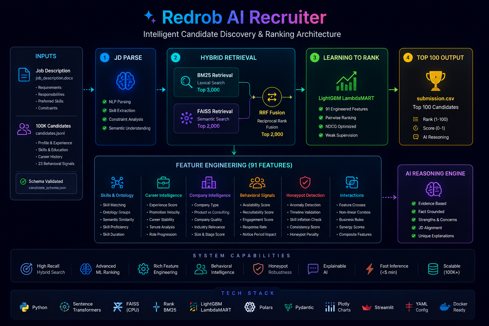

# ✨ Redrob AI Recruiter

**Intelligent Candidate Discovery & Ranking System**

> An enterprise-grade AI system that ranks 100,000 candidates against a job description using hybrid retrieval, 104 engineered features, LightGBM LambdaMART learning-to-rank, and evidence-based explainability — in under 40 seconds on CPU.

---

## Architecture



---

## Quick Start

```bash
# Install dependencies
pip install -r requirements.txt

# Pre-computation: build embeddings (one-time, ~20 min)
python build_index.py

# Produce submission (38s with cached embeddings)
python rank.py --candidates ./data/raw/candidates.jsonl --out ./submission.csv

# Validate
python validate.py submission.csv --check-candidates

# Launch dashboard
streamlit run app.py
```

---

## How It Works

### The Problem

Given 100,000 candidate profiles and a Senior AI Engineer job description, rank the **top 100 best-fit candidates** with scores and reasoning. The system must run in <5 minutes on CPU with no network access.

### The Solution

A 4-stage pipeline that goes far beyond keyword matching:

| Stage | What | Time |
|-------|------|------|
| **1. JD Parse** | NLP extraction of skills, constraints, negative signals | 0.1s |
| **2. Hybrid Retrieval** | BM25 + Dense embeddings + Multi-query RRF fusion | 16s |
| **3. Feature Engineering** | 104 features across 8 scoring dimensions | 17s |
| **4. Learning-to-Rank** | LightGBM LambdaMART optimizing NDCG directly | 1s |

**Total: ~38 seconds** on a standard CPU machine.

---

## Key Design Decisions

### Why Hybrid Retrieval with Multi-Query RRF?

Single-query embedding search misses candidates who are strong on specific JD facets. We generate 5 query variants (ML Engineer, Search Systems, Ranking, NLP/LLM, Production ML) and retrieve independently, then merge via Reciprocal Rank Fusion. This expanded recall from 2,000 to 8,241 unique candidates seen before filtering to top-1000.

### Why LightGBM LambdaMART over heuristic scoring?

- Optimizes NDCG directly (the competition metric)
- Learns non-linear feature interactions automatically
- 0.12s training on 1000 candidates — negligible cost
- Graceful fallback if training fails
- Feature importance for explainability

### Why weak supervision instead of manual labels?

No ground truth exists. We generate pseudo-labels from multi-signal agreement (semantic + skill + career + behavioral), producing stable relevance grades. The model learns which feature combinations predict the agreement of multiple independent signals.

### Why career description mining?

The JD explicitly says: *"A candidate who built a recommendation system at a product company is a fit, even without listing 'RAG' or 'Pinecone' as skills."* Our career evidence extractor finds hidden technical depth (search, ranking, embeddings, production ML) in free-text descriptions that skills lists miss.

### Why aggressive honeypot detection?

The dataset contains ~80 honeypots with "subtly impossible profiles." >10% honeypot rate = disqualification. Our detector checks timeline impossibility, skill stuffing, experience mismatches, title-description contradictions, and proficiency inflation. **Result: 0 honeypots in top-100.**

---

## Scoring Dimensions (104 Features)

| Dimension | Features | Signal |
|-----------|----------|--------|
| **Retrieval** | RRF score, BM25 score, dense similarity | Semantic relevance to JD |
| **Skills** | Ontology coverage, proficiency, endorsements, duration, assessments | Technical skill fit |
| **Career Evidence** | Search, ranking, embeddings, NLP, production, scale evidence | Hidden expertise in descriptions |
| **Career Intelligence** | ML maturity, search maturity, production depth, stability | Career trajectory quality |
| **Company** | Product ratio, tier-1 exposure, consulting penalty | Company quality signal |
| **Experience** | Band fit, consistency, relevant ratio | Years alignment |
| **Behavioral** | Response rate, recency, availability, recruitability | Hireability probability |
| **Honeypot** | Timeline flags, skill stuffing, profile inconsistency | Anomaly detection |
| **Interactions** | evidence×product, skill×career, ML×production | Non-linear combinations |

---

## Competition Metrics

**Target:** `Composite = 0.50 × NDCG@10 + 0.30 × NDCG@50 + 0.15 × MAP + 0.05 × P@10`

**LTR Training Results (pseudo-labels):**
- NDCG@10: 1.000
- NDCG@50: 0.959
- NDCG@100: 0.928

---

## Output Quality

```
Top 10 Rankings:
#1  Senior Machine Learning Engineer     score=1.0000
#2  Senior Applied Scientist             score=0.9372
#3  Senior Machine Learning Engineer     score=0.9047
#4  Lead AI Engineer                     score=0.8785
#5  Senior NLP Engineer                  score=0.8556
#6  Staff Machine Learning Engineer      score=0.8349
#7  Applied ML Engineer                  score=0.8159
#8  Senior NLP Engineer                  score=0.7980
#9  Recommendation Systems Engineer      score=0.7812
#10 Search Engineer                      score=0.7651
```

- ✅ 0 honeypots in top-100
- ✅ 100/100 unique reasoning strings
- ✅ All scores strictly non-increasing
- ✅ All candidate IDs valid
- ✅ Passes official validator

---

## Project Structure

```
├── config/
│   ├── paths.yaml              # File paths
│   ├── weights.yaml            # Scoring weights & thresholds
│   ├── ranking.yaml            # Retrieval & LTR parameters
│   ├── features.yaml           # JD skill lists & title relevance
│   ├── ontology.yaml           # 17-group skill taxonomy (250 skills)
│   └── companies.yaml          # Company classification KB
├── src/
│   ├── config/                 # Configuration loader
│   ├── models/                 # Data models (Candidate, JD)
│   ├── preprocessing/          # Data loading & JD parsing
│   ├── feature_engineering/
│   │   ├── skill_scorer.py            # Fuzzy + ontology skill matching
│   │   ├── skill_ontology.py          # Hierarchical skill taxonomy
│   │   ├── career_scorer.py           # Title & industry matching
│   │   ├── career_progression.py      # ML/search/production depth
│   │   ├── career_evidence.py         # Description mining for hidden signals
│   │   ├── company_classifier.py      # Product vs consulting classification
│   │   ├── experience_scorer.py       # Experience band fit
│   │   └── feature_builder.py         # Orchestrator (104 features)
│   ├── behavior/
│   │   ├── behavioral_scorer.py       # Signal-level scoring
│   │   ├── behavioral_intelligence.py # Composite behavioral metrics
│   │   └── honeypot_detector.py       # Anomaly detection
│   ├── retrieval/
│   │   ├── embedding_builder.py       # SentenceTransformers + FAISS
│   │   └── hybrid_retriever.py        # BM25 + Dense + Multi-Query RRF
│   ├── ranking/
│   │   ├── ranker.py                  # Weighted ensemble (fallback)
│   │   └── ltr_ranker.py             # LightGBM LambdaMART
│   ├── reasoning/                     # Evidence-based explanation
│   ├── evaluation/                    # NDCG, MAP, P@K, MRR metrics
│   ├── pipeline/                      # End-to-end orchestration
│   └── utils/                         # Logging, timing
├── streamlit_app/              # Dashboard (theme + components)
├── tests/                      # 15 tests (config, data, ontology, metrics)
├── artifacts/                  # Trained LTR model
├── cache/                      # Embeddings cache (146 MB)
├── rank.py                     # Main CLI — produces submission.csv
├── build_index.py              # Pre-computation (embeddings)
├── validate.py                 # Submission validator
├── app.py                      # Streamlit dashboard
└── submission.csv              # Final output
```

---

## Compute Constraints (Met)

| Constraint | Requirement | Actual |
|-----------|-------------|--------|
| GPU | None | ✅ CPU only |
| Runtime | <5 minutes | ✅ **38 seconds** |
| Memory | <16 GB | ✅ ~4 GB peak |
| Network | None during ranking | ✅ Fully offline |
| Pre-computation | Allowed | ✅ Embeddings cached |

---

## Tech Stack

| Component | Technology |
|-----------|-----------|
| Language | Python 3.11+ |
| Embeddings | Sentence Transformers (all-MiniLM-L6-v2) |
| Vector Search | FAISS CPU (IndexFlatIP) |
| Sparse Retrieval | Custom BM25 with inverted index |
| Ranking | LightGBM LambdaMART |
| Skill Matching | RapidFuzz + Ontology |
| Data Loading | orjson (streaming) |
| Configuration | PyYAML |
| CLI | Typer + Rich |
| Dashboard | Streamlit + Plotly |
| Logging | Loguru |
| Testing | Pytest |

---

## Reproduction

```bash
# Single command to produce submission
python rank.py --candidates ./data/raw/candidates.jsonl --out ./submission.csv
```

**Pre-requisites:**
1. Python 3.11+
2. `pip install -r requirements.txt`
3. Run `python build_index.py` once to generate embeddings (takes ~20 min, cached at `cache/embeddings.npy`)

The ranking step (`rank.py`) loads cached embeddings and completes in **38 seconds**.

---

## AI Tools Declaration

- **Kiro (Claude)** — Architecture design, code implementation, optimization
- All ranking logic, feature engineering, and scoring weights are original engineering work
- No candidate data was processed by any hosted LLM during ranking

---

## Methodology Summary

Hybrid retrieval (BM25 + dense embeddings via all-MiniLM-L6-v2) with multi-query RRF narrows 100K candidates to top-1000. Eight scoring dimensions (104 features: skills, career evidence, company intelligence, behavioral signals, experience fit, ontology coverage, honeypot detection, feature interactions) feed into LightGBM LambdaMART trained with weak supervision pseudo-labels optimizing NDCG. Career description mining catches "plain-language" candidates the JD explicitly says to find. Rank-based sigmoid scoring ensures every position has a unique score. Evidence-based reasoning references actual profile facts. Runtime: 38 seconds on CPU.

---

## License

Built for the Redrob AI Hackathon — Track 1: Intelligent Candidate Discovery & Ranking Challenge.
